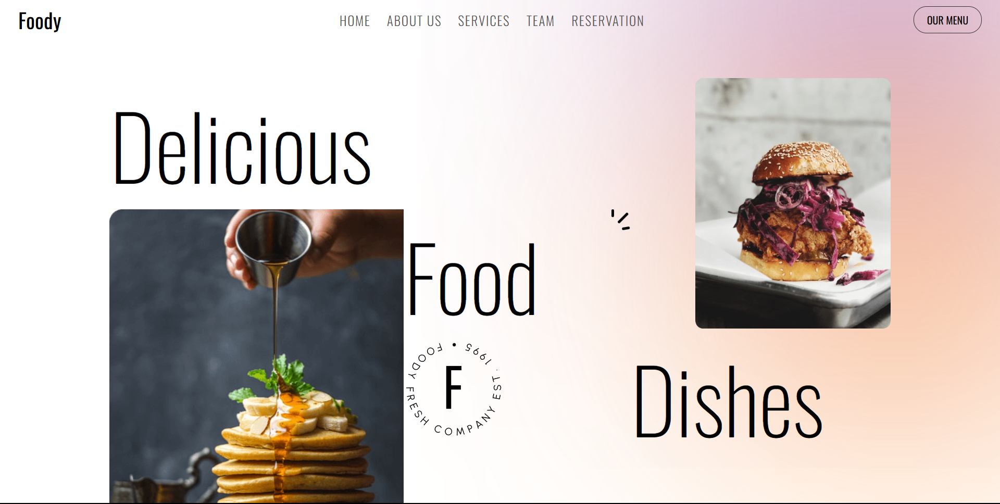

# Restaurant-website
This is a MERN stack based Restaurant-Website project, where customers can smoothly navigate through different varieties of food and can make reservation for particular food.

# Setup-Guide
step 1 : Firstly visit backend folder, then create .env file 
step 2 : Then create three variables in this file PORT, MONGO_URI and FRONTEND_URL 
step 3 : Initialize the MONGO_URI to the unique link provided by mongoose atlas database 

# Required Node-modules
1. Express : To create APIs and handle routing, middleware, and server-side logic. 
2. Mongoose : For interacting with database 
3. Dotenv : To load environment variables 
4. Cors : For frontend and backend integration 
5. Validator : To validate user while reservation 

# Database
Use <b>Mongoose Atlas</b> database to stored user reservation securely.